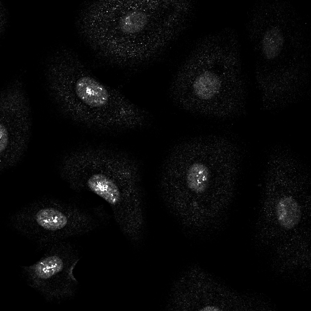
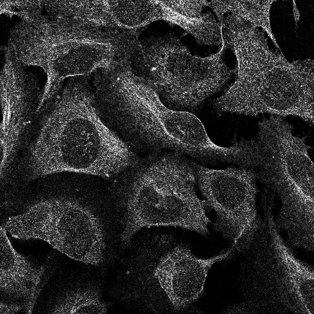
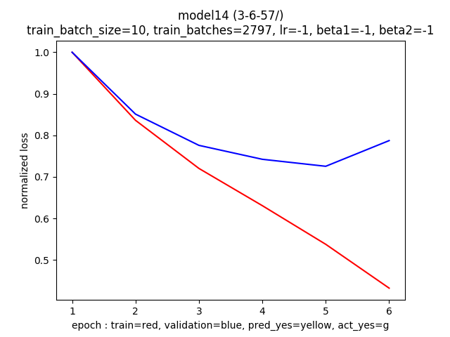
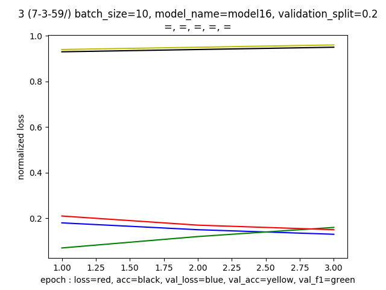
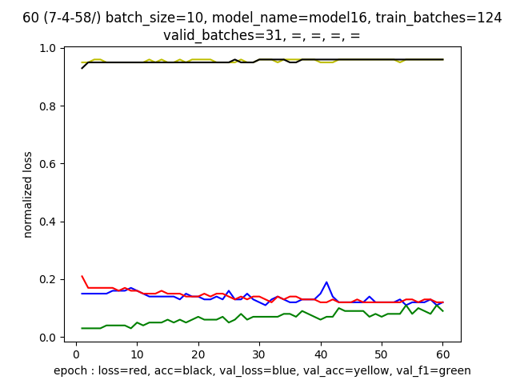

# Identifying Cellular Structures in Microscope Images with Deep Learning Techniques.

# The Challenge

We must identify as present or absent 28 different cellular structures.

###The cellular substructures are:

            0: "Nucleoplasm",
            1: "Nuclear membrane",
            2: "Nucleoli",
            3: "Nucleoli fibrillar center",
            4: "Nuclear speckles",
            5: "Nuclear bodies",
            6: "Endoplasmic reticulum",
            7: "Golgi apparatus",
            8: "Peroxisomes",
            9: "Endosomes",
            10: "Lysosomes",
            11: "Intermediate filaments",
            12: "Actin filaments",
            13: "Focal adhesion sites",
            14: "Microtubules",
            15: "Microtubule ends",
            16: "Cytokinetic bridge",
            17: "Mitotic spindle",
            18: "Microtubule organizing center",
            19: "Centrosome",
            20: "Lipid droplets",
            21: "Plasma membrane",
            22: "Cell junctions",
            23: "Mitochondria",
            24: "Aggresome",
            25: "Cytosol",
            26: "Cytoplasmic bodies",
            27: "Rods & rings"

### Examples of the microscope images are given below, along with the cell structure labels

    <figcaption>Fig 1: The figure on the left belongs to the classes: [0, 3]. The figure on the right belongs to the classes: [14, 16, 21] </figcaption>

The challenge is to predict the labels given these images. (Each image has 4 channels. Above I have shown the green channel, which shows the protein of interest. The models I build below will take as input all the images) 

## AWS Workflow

Before I dive into my process of trying out various models, I will summarize my workflow.

I had two methods for starting AWS machines. 

### method 1 (aws consol method):

1. Sign into the consol at aws.amazon.com
2. Manually start a g3.4xlarge machine
3. get the public DNS for the machine
4. scp a local copy of __initAws.sh__ into the aws machine
5. ssh into the aws machine, and run `sh initAws.sh`. This script builds the directory structure I desire, pulls my latest work from github, installs Docker, installs emacs, and runs the script __launchData.sh__. This script launches a container that downloads the dataset from kaggle, and places it in the appropriate directory. After the container finishes, it exits.
6. I then launch a container that has the data directories mounted with the following command. Note that 'ralston' is now a directory in the container, the name is arbitrary. This is done with the command `docker run -itv $(pwd):/ralston kaggle/python `

The setup process is completed, and I am ready to train models.

### method 2 (aws CLI method)

Note: this method requires a custom AMI to exist in your account. The name of this image is inserted in __connection/virtualmachine.sh__

1. use Terminal to navigate to connection/, and run `sh virtualmachine.sh`. Note, this script takes one argument that it uses to name the security group. I usually type an integer. Note that you must go delete security groups in the consol if you wish to reuse the same number. It will look like `sh virtualmachine.sh 1`
2. run `sh upcow.sh`
3. run `sh upme.sh`. Now you are on the command line for the remote machine.
4. run `sh cow.sh` (on the remote machine)
5. Now you are inside a docker container running on an aws machine. Navigate to the directory named 'ralston/' with `cd ralston`. You are now ready to train on the aws machine.
6. After you have trained the models, return to connection/ on your local machine, and type `sh downmodels.sh` and after it has finished downloading your models to your local machine, run `sh shutdown.sh`

Troubleshooting: you may need to fix the files in connection/ called instanceid.txt and publicname.txt. You do this by removing newlines from the top of the file so that there is only one line in the file.

## Jupyter Notebook
If you would like to run a jupyter notebook with a docker backend (the image kaggle/python), navigate to root of this project and run `sh kaggleJupyter`

# The solution
The following is my story of solving this challenge, given that I have never before done an image processing problem.

## First attempt
Variants of simple models were built and trained on AWS servers to predict labels. These models were small, with only tens of thousands of weights, typically consisting of sequential groups of convolutional layers and pooling layers. You can view the results for these models in the logs/ directory, they are known as model5, model6, model7, and model8. Typically, their validation loss increased while their training loss decreased. 
I subclassed keras.utils.generator to serve up the images, and used the fit_generator() method of the keras 'model' object. The optimizer was typically keras.optimizers.Adam, and I searched over a 4-dimensional parameter space of over many degrees of magnitude, never finding a successful model.

## Other's work
I studied kaggle kernals written by Vitoly Byranchonok and Michal Haltuf, and verified their results. This expanded my toolbox substantially. 

Vitoly Byranchonok had a image generator which was superior to my original image generator in a number of ways.  

* It compressed the image into a form acceptable to the model in an efficient way.  
* It augmented each image, by generating rotations and reflections of the object to train on.  
* It randomly selected images for each batch, allowing you to make your epoch size variable, which in turn enables loss plots more pleasing to the eye.
* It is implemented in fewer lines

Vitoly introduced me to keras.applications, a library of pretrained models ready for use. 

Michal Haltuf had an image generator which was similiar to my original image generator, except that it took better advantage of available RAM resources by caching.

Note: unless otherwise stated, the batch size is 10.

## Reproducing successful models
I trained a model by Vitoly, and a model by Michal. The resulting models were performant on validation data. They earned raw competition scores of .120 (V) and .115 (M), and achieved f1 scores of .1101 (V) and .1047 (M). The Vitoly Model trained at a rate of .6 seconds per image (V), while the Michal Haltuf model trained at a rate of .05 seconds per image (M). This is attributable in part to different model sizes, with Vitoly having 58 million weights (V) and Michal having only 200,000 weights (M). Details can be viewed in the logs at model14() and model16().
  

## Improving training time (3-6-57/)
An issue while training the above models was training speed. It took about 10 hours to train on 60,000 images. This is too slow, and training was terminated while scores were still improving.

Vitoly's generator is favored over Michal's for its image augmentation, simplicity of implementation, and randomized image selection. However, it lacks the ability to cache images. I modified Vitoly's generator to cache images, hoping to speed up training time. 

	<figcaption>Figure 99: Trainging session 3-6-57. InceptionResNet trained for 39 hours over 180,000 images. Training speed 1.6 im/sec<figcaption/>

Training speed is not improved, so we return to our strategy of reading and writing to the disk.

## Improve Score: predict fewer classes 
In order to improve scores, I trained an instance of model14() to predict the first 14 classes, and another instance of model14() to predict the last 14 classes. Training session 7-3-59/ trained a model to predict the first 14, and training session 7-4-58/ trained a model to predict the last 14. 

Furthermore, one instance was trained with all images loaded into RAM first. 

	<figcaption>Figure 99: loss and validation curves for training models to fit only 14 classes at a time. Training session 7-3-59/ is on the left, training session 7-4-58/ is on the right.<figcaption/>

We see that the model predicts the first 14 classes and the last 14 classes with about the same efficacy. The graph on the left (for the first 14 classes) is smoother because I used a different image generator (in order to load all images into RAM).

### Results
The model predicting the first 14 classes scores a .13, and the model predicting the last 14 scores a .07, and together they score a .20. This is not an improvement over the last model, and we assume that our model has enough 'learning capacity' to handle all 28 classes.

## Improve Score: smaller model, the InceptionV3 network

--- todo

## Improve Score: Regularize and Normalize the suffix network

--- todo

## Improve Score: Search over hyperparameters

-- todo

## Improve Score: Fully train best models, evaluate performance

-- todo

## Improve Score: Optimal Thresholds

-- todo

## Best Model

-- todo

### Optimal Thresholds and image generation strategies
At this point, I suspect that image augmentation improves score substantially, as does proper thresholding, and that caching is not helpful. These conclusions can be drawn from training sessions 3-6-57/, and the earlier that just have the other peoples work. When 3-6-57/ is thresholded in the same manner as, it gets the same score even though it trained longer. The only difference is aumentation and random sampling. SO I like random sampling and augmentation and proper thresholding. You can see a big improvement in the score when thresholded properly. You see superior performance despite shorter training. You see no improvement in training speed. Compare vitoly verbatim with vitoly model/modified haltuf generator. 

