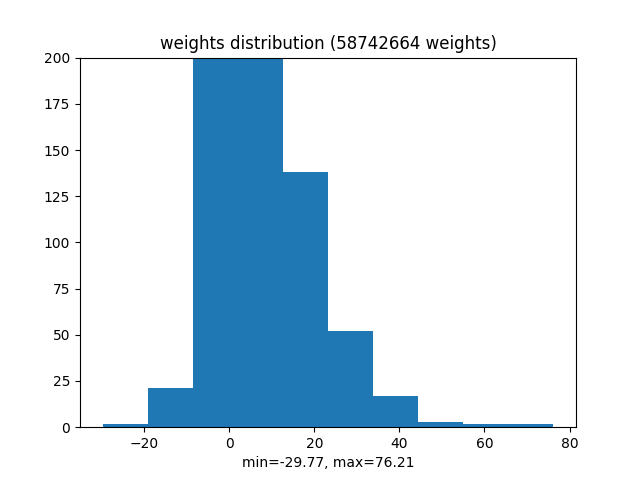

# Identifying Cellular Structures in Microscope Images with Deep Learning Techniques

## The Challenge

We must identify as present or absent 28 different cellular structures.

###The cellular substructures are:

            0: "Nucleoplasm",
            1: "Nuclear membrane",
            2: "Nucleoli",
            3: "Nucleoli fibrillar center",
            4: "Nuclear speckles",
            5: "Nuclear bodies",
            6: "Endoplasmic reticulum",
            7: "Golgi apparatus",
            8: "Peroxisomes",
            9: "Endosomes",
            10: "Lysosomes",
            11: "Intermediate filaments",
            12: "Actin filaments",
            13: "Focal adhesion sites",
            14: "Microtubules",
            15: "Microtubule ends",
            16: "Cytokinetic bridge",
            17: "Mitotic spindle",
            18: "Microtubule organizing center",
            19: "Centrosome",
            20: "Lipid droplets",
            21: "Plasma membrane",
            22: "Cell junctions",
            23: "Mitochondria",
            24: "Aggresome",
            25: "Cytosol",
            26: "Cytoplasmic bodies",
            27: "Rods & rings"

### Examples of the microscope images are given below, showing presence and absence of class 0 (nucleoplasm).

<figure>
       <figcaption>Fig 1: Here we see two images with the nucleoplasm visible (top), and two images without the nucleoplasm (bottom)</figcaption>
</figure>

### Examples with full classification:

<figure>
    <figcaption>Fig 2: The figure on the left has the classification: [0, 3, 5]. The figure on the right has the classification: [4, 27] </figcaption>
</figure>

# The solution

The following is my story of solving this challenge, given that I have never before done an image processing problem.

### First attempt
Variants of simple models were built and trained on AWS servers to predict labels. These models were small, with only tens of thousands of weights, typically consisting of sequential groups of convolutional layers and pooling layers. You can view the results for these models in the logs/ directory, they are known as model5, model6, model7, and model8. Typically, their validation loss increased while their training loss decreased. 
I subclassed keras.utils.generator to serve up the images, and used the fit_generator() method of the keras 'model' object. The optimizer was typically keras.optimizers.Adam, and I searched over a 4-dimensional parameter space of over many degrees of magnitude, never finding a successful model.

### Other's work
I studied kaggle kernals written by Vitoly Byranchonok and Michal Haltuf, and verified their results. This expanded my toolbox substantially. 

Vitoly Byranchonok had a image generator which was superior to my original image generator in a number of ways.  

* It compressed the image into a form acceptable to the model in an efficient way.  
* It augmented each image, by generating rotations and reflections of the object to train on.  
* It randomly selected images for each batch, allowing you to make your epoch size variable, which in turn enables loss plots more pleasing to the eye.
* It is implemented in fewer lines

Vitoly introduced me to keras.applications, a library of pretrained models ready for use. 

Michal Haltuf had an image generator which was similiar to my original image generator, except that it took better advantage of available RAM resources by caching.

Note: unless otherwise stated, the batch size is 10.

### Reproducing successful models
I trained a model by Vitoly, and a model by Michal. The resulting models were performant on validation data, and thus successful. They earned raw competition scores of .120 (V) and .115 (M), and achieved f1 scores of .1101 (V) and .1047 (M). The Vitoly Model trained at a rate of .6 seconds per image (V), while the Michal Haltuf model trained at a rate of .05 seconds per image (M). This is attributable in part to different model sizes, with Vitoly having 58 million weights (V) and Michal having only 200,000 weights (M). Details can be viewed in the logs at model14() and model15().

###   

### Improving training time
An issue while training the above models was training speed. It took about 10 hours to train on 60,000 images. This is too slow, and training was terminated while scores were still improving.

Vitoly's generator is favored over Michal's for its image augmentation, simplicity of implementation, and randomized image selection. However, it lacks the ability to cache images. I modified Vitoly's generator to cache images, hoping to speed up training time. 

<figure>
	<figcaption>Figure 99: Trainging session 3-6-57. InceptionResNet trained for 39 hours over 180,000 images. Training speed 1.6 im/sec<figcaption/>
</figure>

Training speed is not improved, so we conduct a more thorough investigation
### Characterizing Training Speed across model sizes and caching strategies
In anticipation of a search over a number of architectures and hyperparameters, the training velocity was measured as a function of batch size and model size, with the results summarized in the next three plots.

##### Vitoly Model + regularized suffix, InceptionResNet, nets.model16()
<figure>
   <figcaption>Fig 3: training speed vs batch size, for a model with size = 58 million </figcaption>
</figure>

##### NewResNet, nets.model17()
<figure>
   <figcaption>Fig 4: training speed vs batch size, for a model with size = 5 million </figcaption>
</figure>

##### Michal Haltuf model, verbatim, nets.model15()
<figure>
   <figcaption>Fig 5: training speed vs batch size, for a model with size = 200,000 </figcaption>
</figure>

### Optimal Thresholds and image generation strategies
At this point, I suspect that image augmentation improves score substantially, as does proper thresholding, and that caching is not helpful. These conclusions can be drawn from training sessions 3-6-57/, and the earlier that just have the other peoples work. When 3-6-57/ is thresholded in the same manner as, it gets the same score even though it trained longer. The only difference is aumentation and random sampling. SO I like random sampling and augmentation and proper thresholding. You can see a big improvement in the score when thresholded properly. You see superior performance despite shorter training. You see no improvement in training speed. Compare vitoly verbatim with vitoly model/modified haltuf generator. 

### Training a few different models using preferred image generation strategies and thresholding strategies.
We see the batch size that maximizes training speed as parametrized by model size, and we choose to train in depth each of these models at their optimal batch size. The models are trained until we can see a definitive rise in the validation score. 

##### Regularized Vitoly Model, loss curves plus weight dist
<figure>
	<figcaption>Figure 13-1: Regularized Vitoly Model, loss curves plus weight, training velocity is <figcaption/>
</figure>

##### NewResNet, loss curves plus weight dist
<figure>
	<figcaption>Figure 13-1: NewResNet, loss curves plus weight, training velocity is <figcaption/>
</figure>

##### michal haltuf, loss curves plus weight dist
<figure>
	<figcaption>Figure 13-1: michal haltuf model, loss curves plus weight, training velocity is <figcaption/>
</figure>

In order to make predictions with these models, I used the validation data to find the optimal threshold for each category.

<figure>
   <figcaption>Fig 99: left: f1 opt for vitoly, middle: f1 opt for NewResNet, right: f1 opt for haltuf</figcaption>
</figure>

Additionally, note the effects of regularization on the weight distribution for the regularized vitoly model versus the unregularized version:

<figure>
   <figcaption>Fig 99: unregularized weights </figcaption>
</figure>

### Improving performance
There are many hyperparamters to twidle here that may improve the score, including 

* the batch size
* the optimizer's learning rate, beta1, beta2, and epsilon parameters

I won't explore these for right now, instead I will train seperate versions of each model for smaller subsets of the training data. For example, I will train one instance of the model to predict the first fourteen classes, and another instance of the model to predict the second 14 instances. In general, the labels are statistically independent of one another throughout the training dataset, so it is preferred to predict them seperately. Breaking into two groups of 14, the results are:
##### 2 groups of 14

Vitoly Models, loss curves plus weight dists, f1 score, raw competition score

NewResNet model, loss curves plus weight dists, f1 score, raw competition score

Michal haltuf model, loss curves plus weight dists, f1 score, raw competition score 

##### 4 groups of 7
Vitoly Models, loss curves plus weight dists, f1 score, raw competition score

NewResNet model, loss curves plus weight dists, f1 score, raw competition score

Michal haltuf model, loss curves plus weight dists, f1 score, raw competition score 
update update update update update update 

WHHhhhsjkdfasdjfa;ksdjfa;kjdsfaksjdfkasjdfa;djf;ad;fja;kj
WHHhhhsjkdfasdjfa;ksdjfa;kjdsfaksjdfkasjdfa;djf;ad;fja;kj
WHHhhhsjkdfasdjfa;ksdjfa;kjdsfaksjdfkasjdfa;djf;ad;fja;kj
WHHhhhsjkdfasdjfa;ksdjfa;kjdsfaksjdfkasjdfa;djf;ad;fja;kj
WHHhhhsjkdfasdjfa;ksdjfa;kjdsfaksjdfkasjdfa;djf;ad;fja;kj
WHHhhhsjkdfasdjfa;ksdjfa;kjdsfaksjdfkasjdfa;djf;ad;fja;kj
WHHhhhsjkdfasdjfa;ksdjfa;kjdsfaksjdfkasjdfa;djf;ad;fja;kj

